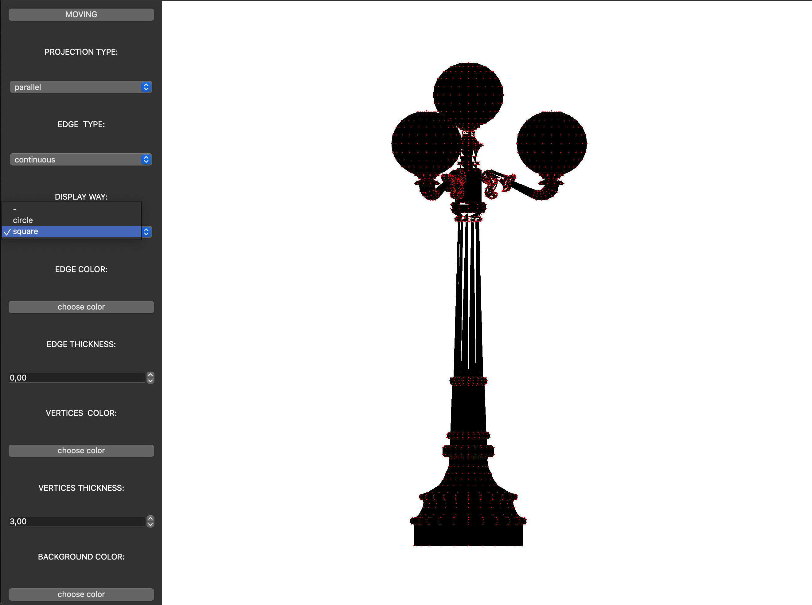

## Отчет по заданию "C8_3DViewer_v1.0":

1) [Условия реализации программы 3DViewer](#part-1-условия-реализация-3DViewer)
2) [Руководство пользователя](#part-2-руководство-пользователя)
3) [Сборка программы 3DViewer](#part-3-сборка)

## Part 1. Условия реализации 3DViewer.
1)Программа должна быть разработана на языке Си стандарта C11 с использованием компилятора gcc. Допустимо использование дополнительных библиотек и модулей QT

2)Код программы должен находиться в папке src

3)Сборка программы должна быть настроена с помощью Makefile со стандартным набором целей для GNU-программ: all, install, uninstall, clean, dvi, dist, tests, gcov_report. Установка должна вестись в любой другой произвольный каталог

4)Программа должна быть разработана в соответствии с принципами структурного программирования

5)При написании кода необходимо придерживаться Google Style

6)Должно быть обеспечено покрытие unit-тестами модулей, связанных с загрузкой моделей и аффинными преобразованиями

7)В один момент времени должна быть только одна модель на экране.

8)Программа должна предоставлять возможность:

- Загружать каркасную модель из файла формата obj (поддержка только списка вершин и поверхностей).

- Перемещать модель на заданное расстояние относительно осей X, Y, Z.

- Поворачивать модель на заданный угол относительно своих осей X, Y, Z

- Масштабировать модель на заданное значение.

9)В программе должен быть реализован графический пользовательский интерфейс, на базе любой GUI-библиотеки с API для C89/C99/C11 

- For Linix: GTK+, CEF, Qt

- For Mac: GTK+, Nuklear, raygui, microui, libagar, libui, IUP, LCUI, CEF, Qt

10)Графический пользовательский интерфейс должен содержать:

- Кнопку для выбора файла с моделью и поле для вывода его названия.

- Зону визуализации каркасной модели.

- Кнопку/кнопки и поля ввода для перемещения модели.

- Кнопку/кнопки и поля ввода для поворота модели.

- Кнопку/кнопки и поля ввода для масштабирования модели.

- Информацию о загруженной модели - название файла, кол-во вершин и ребер.

11)Программа должна корректно обрабатывать и позволять пользователю просматривать модели с деталями до 100, 1000, 10 000, 100 000, 1 000 000 вершин без зависания (зависание - это бездействие интерфейса более 0,5 секунды).

## Part 2. Руководство пользователя.

1) Запуск программы:

        Для того, чтобы запустить прорамму, напишите в терминале: "Make dist". На вашем рабочем столе появится папка под названием "dist", в котороый будет находиться ярлык программы.
    
2) Как открыть фаил: 

        Для того, чтобы открыть фаил, вам необходимо нажать кнопку "faile" в левом верхнем углу. В программе поддержитьвается только открытие файлов формата ".obj", другое расширение вбрать не получится.
    
3) Что делать, если модель не отображается на экране?

        Если вы сделали все верно, а модель не отобразилась, нажмите на кнопку "centralization" в левом верхнем углу. Она переместит вашу модель в центр экрана.
    
4) Перемещение модели.

        Чтобы переместить модель, вам необходимо воспользоваться настройками в левом нижнем углу.
    
        MOVE - выполняет перемещение модели по осям. 
        +X вправо / -X влево
        +Y вверх / -Y вниз
        +Z вперед / -Z назад
    
        ROTATE - выполняет вращение модели по осям. 
        +X на вас / -X от вас.
        +Y влево от вас / -Y вправо от вас.
        +Z против часовой стрелки / -Z по часовой стрелки.
    
        Так же программа поддерживает перемещение модели мышкой. Для этого вам необходимо нажать на модель левой кнойпкой мыши и переместить ее по нужной оси.
    
5) Приблежение модели. 

        Чтоы приблизить модель, необходимо воспользоваться настройками в левом нижнем углу.
    
        (+SCALE > 1) приблизить модель / (+SCALE < 1) отдалить модель.
    
6) Настройки отображения модели.

        Для того, чтобы изменить отображение модели, вам необходимо нажать на кнопку "settings" в левом верхнем углу. Чтобы вернуться к главному окну, нажмите на кнопку  "BACK" в левом верхнем углу.
    
1)PROJECTION TYPE - задать тип проекции.
    
        parallel - параллельная проекция.
            Проекция представляет собой бесконечное расстояние между центром проекции и проекционной плоскостью.
            
   

        central - центральная проекция.
                Проекция представляет собой конечное расстояние между центром проекции и проекционной плоскостью.
    

 
    
2)EDGE TYPE - задать тип отображения линий.
    
        continuous - отображение прямой линией.
        

        
        dotted - отображение пунктирной линией. 
       
       
        
3)DISPLAY WAY - отображение типа.

        circle - отображение кругами.
        
 

        square - отображение квадратами.
        
 
        
4)EDGE COLOR - задать цвет ребрам модели.
    
5)EDGE THICKNESS - задать размер ребрам модели.
    
 

6)VERTICES COLOR - задать цвет вершинам модели.
    
7)VERTICES THICKNESS - задать размер вершинам модели.
    
 
    
8)BACKGROUND COLOR - задать цвет фона. 
    
    
7) Рендер. 

        Чтобы сделать рендер модели, вам необходимо перейти в главное окно. Если вы находитесь не в нем, нажмите на кнопку в левом верхнем углу "MOVING".
    
        Находясь в главном окне, вы можете сделать два разных рендера.
    
        GIF - рендер в формате gif-анимации. 
        После нажатия на кнопку, у вас начнется запись gif-анимации. Она будет длиться ровно 5 секунд. После чего на экране появиться окно, оповещающее, что запись оконченa.
    
        picture - рендер в формате изображения.

8) Как выйти из программы и сохранить настройки?

        Чтобы выйти из программы, вам необходимо нажать на крестик в левом верхнем углу. После нажатия на него, настройки окна "settings" сохраняться автоматически.
    

## Part 3. Сборка.

1) В сборке программы используются цели:

     \-
    all/install: собирает весь проект.

    \-
    s21_calculator.a: собирает библиотеку.

    \-
    leaks: проверяет результаты тестов на утечки памяти.

    \-
    uninstall: удаляет сборку.

    \-
    clean: очищает проект.

    \-
    dvi: открывает отчет.

    \-
    dist: архивирует проект, созавая папку "dist" на рабочем столе.

    \-
    test: запускает тесты.

    \-
    gcov_report: открывает отчет по покрытию файлов тестами.

    \-
    style: подгоняет под код программы стандарты Google, и проверяет логику в коде. 

